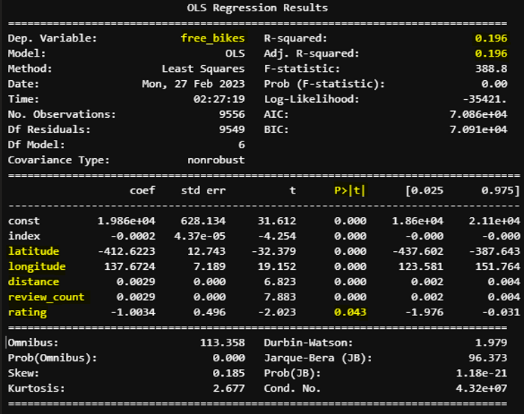

# Project Statistical Modelling with Python

## Project/Goals 🎯

The objective of this project is to construct a robust statistical model using Python and several libraries, including pandas, numpy, seaborn, matplotlib, PIL, among others. Its primary aim is to extract, cleanse, transform, analyze, and develop a model to evaluate data from three distinct APIs: CityBikes, Foursquare, and Yelp. For this purpose, the city chosen was Paris, which boasts a vast network of bike stations.

Paris has implemented various measures to promote cycling as a sustainable and efficient mode of transportation, with the help of government initiatives. One of the most notable initiatives is the introduction of the bike-sharing system known as "Vélib." In recent years, Paris has continued to invest in cycling infrastructure, including the expansion of bike lanes, improved signage, and the creation of low-traffic or car-free zones in certain areas. These efforts aim to enhance cyclist safety and encourage more people to choose bicycles as their preferred mode of transportation.

## Process ⚙️

1. Loading in the City Bikes API to select chosen city of Paris showing all available bike stations in the area
2. Loading in the Foursquare and Yelp APIs to connect their points of interest (POIs) to my city bikes information 
3. Merging city bikes table with Foursquare and Yelp table to see further information of the all related bike stations
4. Importing merged data to create a linear regression model where I only kept relevant variables in the model 

## Results 📊

This model aims to analyze how independent variables influence the availability of bikes, as measured by the dependent variable 'free_bikes.' The study reveals a correlation between 'free_bikes' and several independent variables, namely latitude, longitude, distance, review_count, and rating.

The R-squared value of 0.196 indicates that approximately 19.6% of the variance in the dependent variable can be explained by the independent variables. This suggests a moderate level of predictive power for the model. Interestingly, the adjusted R-squared value remains the same, indicating that there is no penalty for adding more independent variables, and they contribute to the overall explanatory power of the model.

When considering the significance of individual variables, the p-values provide valuable insights. It is observed that all variables, except for the 'rating,' demonstrate significance in predicting the number of free bikes in a given location. This implies that latitude, longitude, distance, and review_count hold substantial predictive value and play a crucial role in understanding bike availability.

Overall, this model sheds light on the relationship between the independent variables and the dependent variable, highlighting the influential factors that affect the number of free bikes. The findings underscore the importance of variables such as location, distance, and user reviews, providing valuable insights for bike-sharing programs and urban planners aiming to optimize bike availability and enhance user experiences.

## Challenges 🚧

Biggest challenge was creating the loops to incorporate the city bikes data and new data from the APIs. I also found it difficult to merge the tables together which included alot of trial and error.

## Future Goals 💡

I would like to study other cities in Europe and see how they compare to Paris in terms of bike stations and their model results.

